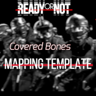

# Ready Or Not Map - RON-Mall-Map

## Description

This repository contains a custom map for the game Ready Or Not. The map, titled RON-Mall-Map, offers an immersive and challenging environment for players to test their skills and tactics. Whether you're a law enforcement officer or a military operator, this map will provide you with intense gameplay and scenarios that will test your limits.

## Features

- **Detailed Environment**: The map is designed with attention to detail, creating a realistic and immersive setting from a real mall located in Clackamas Oregon. From buildings to interiors and outdoor areas, every aspect has been carefully crafted to enhance the gameplay experience.

- **Multiple Objectives**: RON-Mall-Map offers a variety of objectives that cater to different playstyles. Whether it's a active shooter, bomb defusal, or stealthy infiltration, the map provides diverse scenarios to keep players engaged and entertained.

- **Tactical Gameplay**: The map encourages strategic thinking and teamwork. With multiple entry points, interconnected areas, and smart AI, players must utilize their skills and coordination to overcome challenges and succeed in their missions.

- **Compatibility**: The map is designed to work seamlessly with the latest version of Ready Or Not. It has undergone testing to ensure stability and performance, providing players with a smooth and enjoyable experience.

## Contributing

add some sort of text here - Kio

## Credits

- Map Creators: [Kiochiishere, PotatDev180]
- Testing and Feedback: [Testers Names would go here?]

Special thanks to the Ready Or Not community for their support and feedback during the development process.

## Contact

If you have any questions, feedback, or inquiries, please feel free to reach out. We appreciate your interest and look forward to hearing from you.

---

We hope you enjoy the map and have an amazing gaming experience. Remember to play fair, communicate with your team, and always be ready for the unexpected.

